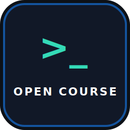

<div class="hero" markdown>

<div class="hero-logo" markdown>

{ width="72" }

</div>

# Open Course CLI

<span class="hero-badge">Terminal · AI · Languages</span>

**Terminal AI tutor for language learning.** Exercises, lessons, and answer analysis are generated by an LLM provider you choose.

<div class="hero-install" markdown>

```bash
cargo install open-course-cli
```

</div>

[:fontawesome-brands-github: GitHub](https://github.com/scriptology/open-course-cli){ .md-button .md-button--primary }

</div>

## Features

<div class="mechanics" markdown>

<div class="mechanics-card" markdown>

### AI-generated exercises & lessons

- Translation exercises tailored to your level and topic
- Lessons and explanations generated on demand
- Answer analysis with scores after every batch

</div>

<div class="mechanics-card" markdown>

### Spaced repetition

- Weak topics and micro-learning items tracked automatically
- Decayed reviews mixed into sessions
- Balanced next-topic selection from the dashboard

</div>

<div class="mechanics-card" markdown>

### Progress dashboard

- Activity history and session scores at a glance
- Weak topics highlighted for focused practice
- Per language-pair curriculum and progress

</div>

<div class="mechanics-card" markdown>

### Any LLM provider

- OpenAI, Anthropic, Gemini, DeepSeek, Mistral
- OpenRouter, Ollama, and custom OpenAI-compatible endpoints
- Model list fetched during onboarding

</div>

<div class="mechanics-card" markdown>

### Local-first data

- LanceDB storage under `.open-course-cli/`
- Isolated tables per language pair
- Global provider settings and preferences

</div>

<div class="mechanics-card" markdown>

### Onboarding & diagnostics

- Wizard for languages, CEFR level, and provider setup
- Automatic model diagnostics after first launch
- Ready to generate your first course immediately

</div>

</div>

## How it works

<div class="steps" markdown>

<div class="step-card" markdown>

### 1. Pick a topic

The dashboard chooses the next balanced session — a new curriculum topic or a decayed review.

</div>

<div class="step-card" markdown>

### 2. LLM generates a batch

Your provider creates a set of translation exercises for the chosen topic.

</div>

<div class="step-card" markdown>

### 3. You translate

Work through the batch in the terminal. Quit anytime with `Ctrl+C` or `q`.

</div>

<div class="step-card" markdown>

### 4. Analysis & scores

Answers are analyzed, scores update, and weak topics feed spaced repetition.

</div>

</div>

<div class="cta-section" markdown>

## Start learning in the terminal

Open Course CLI is free and open source. Bring your own API key — or run fully local with Ollama.

[:fontawesome-brands-github: View on GitHub](https://github.com/scriptology/open-course-cli){ .md-button .md-button--primary }

</div>
